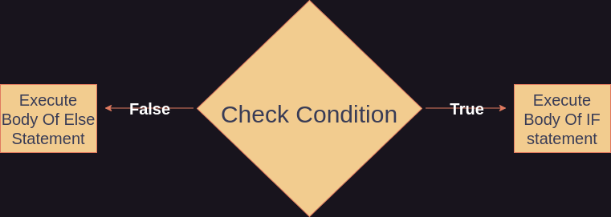
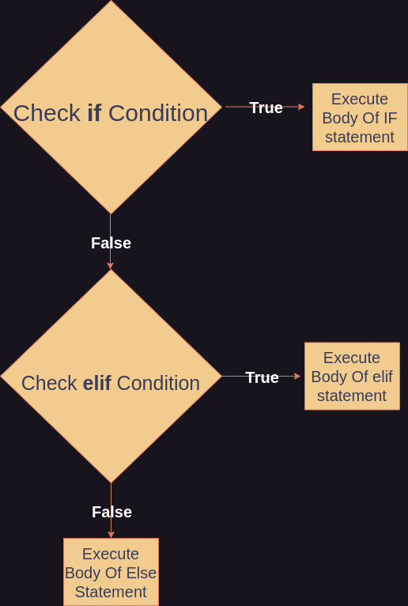

# Else Statements

## Control Flow
Say you've written a program that contains an **if** statement. But you would like the program to so something else if the *if* statement's condition is false and the *if* statement's body does not execute. This is known as *control flow*. Control flow is the control of the order of execution of code in your program. By using conditional statements of different kinds we can control what happens based on these conditions. 

## else statements
The conditional statement we can use to execute code if the body of an *if* statement does not execute is an *else* statement. An else statement checks a condition following an if statement if and only if the conditional of the if statement was false and the if statement did not execute its body. 

Say we would like to continue the example from the previous section by having the program do something else since the condition of the *if* statement is false.

```Python
x = 10
if ( x > 21 ):
    print("x is larger than 21")
else:
    print("x is 21 or smaller")
```
Here an *else* statement comes directly after the *if* statement. The *else* statement's body is `print("x is smaller than 21")`, and it will execute since the body of the if statement does not. Note that an *else* statement has no conditional check. However there is technically an implicit condition: that the condition of the if statement is false. Because an *else* statement will not execute its body if the *if* statement has already executed its.


*The flow from an if statement to an else statement*

## else if statements 
The *elif* statement - short for *else if* however, is an *else* statement with a condition. So it executes its body if the previous *if* statement did not execute its body **AND** the *elif* statement's condition is true. So, where a if-else block can be used for 2 possible outcomes, an if-elif-else block can be used for 2 or more possible outcomes. Keep in mind that if the *if* statement executes its body, nothing else is done. The flow stops at the *if* statement if it has a true condition.



*The flow from if to elif to else statement*

```Python
x = 19
if ( x > 21 ):
    print("x is larger than 21")
elif (x > 14):
    print("x is larger than 14")
else:
    print("x is 14 or smaller")
```
Here, the value of x is checked twice before the else statement finally executes. This structure could be extended using as many *elif* statements as necessary.

# Nesting

Just like functions, conditional statements can be *nested* as well. Recall nesting means to contain one structure within another. For example:

```Python
x = "Hello"
y = " World!"

if (x == "Hello"):
    if (y == " World!"):
        print(x+y)
```

Here the body of the next if statement executes since the inner condition and outer condition are both true. Not that this is logically the same as **AND**ing the conditions in a single if statement since **BOTH** conditions must be true.
```Python
x = "Hello"
y = " World!"

if ( x == "Hello" and y == " World!"):
    print(x+y)
```

---

## Further Reading 

[Control Flow](https://en.wikipedia.org/wiki/Control_flow)

[Python Docs on Control Flow](https://docs.python.org/3/tutorial/controlflow.html)
