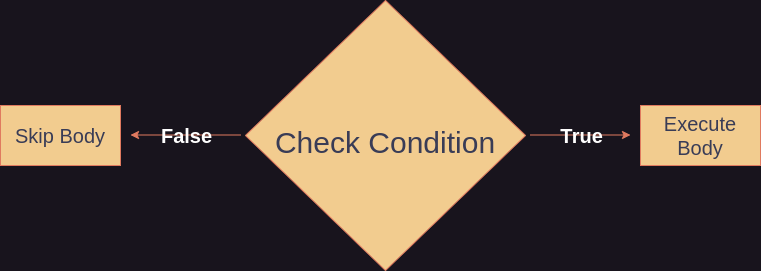

# What Is a Conditional?

A *conditional* statement is one where something is true based on, or under the condition that, something else is true.
Sometimes conditional statements are referred to as if statements.

## Conditionals In Human Language
Conditional statements exist in human language. For example: 

> If I get a birthday gift, I will be happy.

In this statement, I am happy **IF** I get a birthday gift. I am happy under the condition that I get a birthday gift. Examples
in human language can be useful in understanding the concept of a conditional. 

## Conditionals In Programming
Conditional statements are very often used in programming. We use them so that certain code will only execute
if something is the case. So if it isn't the case, the code won't execute. Recall the boolean data type. 
Booleans are either true or false. In programming we use Booleans to represent the truthfulness of a condition.

## Condition & Body Structures

Any structure involving conditions in Python - and most programming languages in general - follows the same basic formatting. 

1. A condition is checked
2. If the condition is true, the *body* executes. The body is the code block that will execute if condition is true.



*Flow chart illustrating conditionals*

Conditional structures in Python have a specific syntax like all programming languages. In Python:
- The line of the conditional statement is ended with a colon: `:`.
- Every line of the body is indented

Indentation is very important in Python. In Python indentation is how the body of certain structures are distinguished form other parts of the structure by the interpreter.

## if statements 

If statements are one of the most basic structures of programming that we will often use. An if statement executes code based on whether a given condition is true. Here is an example of a basic if statement in Python:

```Python
if (True):
    print("Hello World!")
```
Using this specific example we can note things about the syntax of an if statement specific to Python:

- The if statement is began with the `if` keyword.
- The condition to be checked is enclosed in parentheses
- The line of conditional statement is ended with a colon
- Every line of the body is indented

In this specific example the the body will always execute since `True` is always true. The next example will have a more complicated condition:

```Python
x = 10
if ( x > 21 ):
	print("x is larger than 21")
```
In this case, the body does not execute. Try replacing x with a larger number, so that the body does execute.

---
## Further Reading
[Conditional](https://en.wikipedia.org/wiki/Conditional_(computer_programming))
