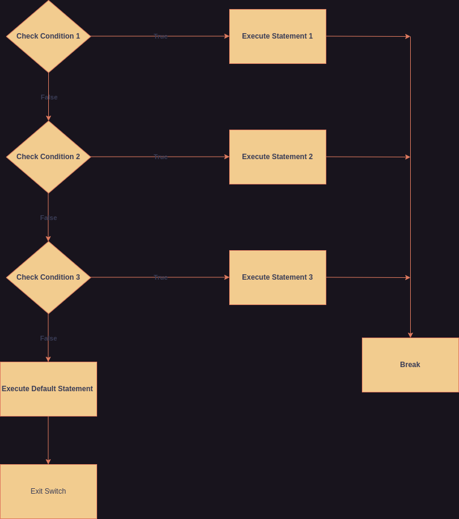

# Switches
Another conditional structure in programming are *switches*. Recall, that another word for options on the command line are switches. A switch structure is how options are often implemented in programs. 

A switch essentially *falls through* a series of conditions, in order, until one is true. When it is true, the body of that condition is executed, and the switch exits. If no conditions are true, the switch either executes a *default case* or exits doing nothing.


*A diagram of an example switch statement*

In Python switch structures can be used for *pattern matching*, as in, comparing strings and seeing if they are the same. A switch is began with the `match` keyword followed by what is to be matched. This line is ended with a colon.

```Python
match "fav_food"
```
Then each case follows. The keyword `case` begins each line. Followed by what is to be checked for. These lines are indented ended with colons. Each case is then followed by an indented body that executes if the condition is true. If it is false, the switch falls through to the next case.

```Python
    case "pizza":
        print("Pizza is my favorite food too!")
```
An example script will be provided that asks a user what they're favorite food is. The script uses a switch to check against known foods. It will return a statement to the user based on what the given food was.

```Python
fav_food = input("What is your favorite food?\n")

match fav_food:
    case "pizza":
        print("Pizza is my favorite food too!")

    case "cake":
        print("Cake is my favorite food too!")

    case "pie":
        print("Pie is my favorite food too!")

    case "sushi"
        print("Sushi is my favorite food too!")

    case _:
        print("I've never had " + fav_food + " before, but is sounds good!")
```

Note that the *default case*, the last case, is denoted by an underscore: `_`. The body of the default case will execute if no other case is true. 

--- 
## Further Reading

[Python Docs on match](https://docs.python.org/3/tutorial/controlflow.html#match-statements)

[Switch Statement](https://en.wikipedia.org/wiki/Switch_statement)

