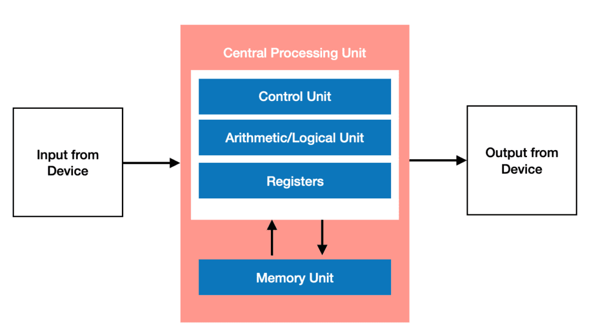
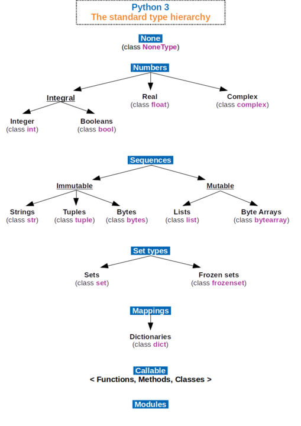

# What Is Data?

Data is simply information. A computer stores data or information in Random Access Memory (RAM), in secondary storage like a hard drive or solid state drive, or in the Central Processing Unit (CPU). When programming, we are primarily using data that is being stored in memory. All the data in your computer's memory are bits: zeroes and ones. This is all a computer truly knows. The same pattern of bits can be defined to represent different things. Programming languages keep track of where the data is and what is represents. What kind of thing the data represents is known as a *type*. 

*An *extremely* simplified layout of a computer known as the Von Neumann architecture*
# Data Types
Python has a number of data types that programmers can use to accomplish their task. They are listed below:

| Name                  | Type      | Description                                         | Mutable | Examples                             |
|-----------------------|-----------|-----------------------------------------------------|---------|--------------------------------------|
| Integer               | int       | Any integer                                         | No      | 7,10,24,-24,-8564, 103811            |
| Floating Point Number | float     | Any decimal number                                  | No      | -73.38, 89.92, 1.0001                |
| Complex               | complex   | Any complex number                                  | No      | 11+7j, -4j                           |
| Boolean               | bool      | A truth value                                       | No      | True, False                          |
| String                | str       | A sequence of characters such as a word or sentence | No      | "Steve", "Jenny", "I saw a balloon." |
| List                  | list      | A list or array of the same data objects            | Yes     | ["Me,"You","Not Them"]               |
| Tuple                 | tuple     | A list or array of objects of any differing types   | No      | ("Me","You",1,2,4.8)                 |
| Dictionary            | dict      | A list of key-pair values                           | No      | "Me":"Yes", "You":"Yes", "Them":"No" |
| Set                   | set       | A list of key values                                | yes     | set([3,5,7])                         |
| Frozen Set            | frozenset | An immutable set                                    | no      | frozenset[("me","you)                |
| Bytes                 | bytes     | A byte value                                        | no      | b'ab\xff'                            |
| ByteArray             | bytearray | A list or array of byte values                      | Yes     | bytearray(...)                       |

*By Максим Пе - Own work, CC BY-SA 4.0, https://commons.wikimedia.org/w/index.php?curid=74062464*

# Visualizing Objects
Python groups bit patterns into *objects*. Objects are like boxes, that keep track of: 
* What type of data is inside of it
* The literal value of the data
* Its location in memory
* How often the object is used

*An object's type determines what its possible values are and what operations can be performed on it*.

Python is known as an *object oriented* language. Keep in mind that not all programming languages utilize objects. In some languages, the programmer must keep track of the location of data, and what type that data is themselves. Due to the object paradigm, Python is a *strongly typed language*. In strongly typed languages, the data type of an object doesn't change implicitly. Essentially, data objects are like a box that exists somewhere in the computer's memory. This box contains the data itself, and everything the computer needs to know what that data means and to use that data. In the next section, we'll cover variables, which are used to give names to different objects.

---
Knowing the different data types a programming language offers allows you to know what ways the language allows you to represent and store information. Since many of the data types Python offers are unique to Python, such as Dictionaries, Sets, and Tuples, we will focus on types that can be found in programming languages more generally. Throughout the book we will focus on the numerical data types, strings, lists, and booleans extensively. In the next sections, we will learn how to name objects of any type using *variables*.

## Further Reading 
[Data Types](https://en.wikipedia.org/wiki/Data_type)

[Python Built-in Types](https://docs.python.org/3/library/stdtypes.html)
