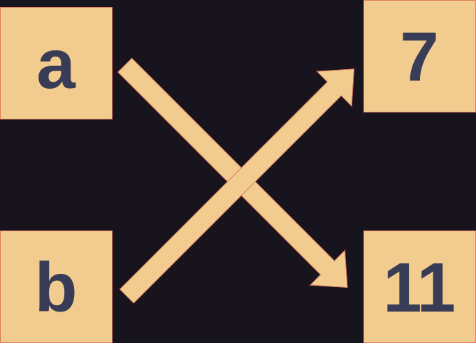

# Variables

There are two ways to represent data values in python:
* Literal Values
* Variables

## Literal Values
Literal Values are the values themselves. If, for example, I type `7` into my python interpreter I am using the literal value 7. If I enter `7+7`. I am adding two literal values and will be returned 14.

## Variables
Most programming languages allow programmers to assign variables to values. Variables are just names. We give the data names so that we can refer to the variables rather than the literal values. This makes the data easier to follow and change. Python has some restrictions on what variable names can be:

* A variable may only contain
	* Lowercase letters
	* Uppercase letters
	* Digits
	* Underscore
* Variables are *case-sensitive*.
* A variable may not begin with a digit
* A variable may not be a *reserved word*.
Reserved words may be found using the command:
```Python
help("keywords")
```

## Assignment
Variables can be *assigned* values using the *assignment* operator: `=`, with the variable name on the left and the value on the right. Operations will be covered in the next section. But for now know that in most programming languages `=` does not mean "equal to" or "is". It is an action that can be thought as "make" or "make equal to".

For example, 
```Python
a = 7
```
could be said in words as "make a 7", "make a equal to 7", or "let a be 7".

And now if a is put into the interpreter it will return 7 because a is now 7 and will be treated as such. 

# Variables and Objects
Recall that in Python all data is organized into objects to help keep track of the data and what the data represents. When we apply our knowledge of Python objects, to what we know about variables and assignment, we can detail what's actually happening. In our previous example we assigned the variable name a to the integer object 7.  Let's extend our previous example and assign something to a.

```Python
a = 7
b = a
``` 
If you recall the transitive property from mathematics you know that if a is 7, and b is a then b is also 7. Now what if we change a from 7 to something else or in other words *reassign* a? 

```Python
a = 7
b = a
a = 11
``` 
What do you think is now the case? Since a is changed is b now changed as well? The answer reveals something important about variables and objects in Python.

## References 
In some programming languages the variable name is a *location*, in other words, in those languages a variables name is the name of a place that contains the data. Python IS NOT one of these languages. In Python variables are *references*. They refer to or *point* to a data object. These types of variables are sometimes called *pointers*. 


*Diagram of our variable names pointing to different objects*

In short, in Python variables are only names. When you assign a variable, you are simply naming some data object. 

Let's return to our previous example:
```Python
a = 7
b = a
a = 11
``` 
In this Python code snippet, the following occurs:

1. a is pointed to an integer object with a value of 7.
2. b is pointed to the value that a point to (7).
3. a is pointed to a new integer object with a value if 11.



So, if you enter `b` into the interpreter, it will return `7`. This is because when you assign b to a, you are simply giving the object `7` two different names: a and b. In other words, you are point b to the same data object a is pointing to. Then, when `a` is assigned to `11`, it is being pointed to a new data object, but that does not change what b is pointing to, so `b` remains 7.

# Variable Naming Conventions

Outside of the Python keywords and rules we can name variables whatever we please. But what is a good variable name. In larger programs, good names are important to keep the code readable. So you, or another person unfamiliar to the code can easily read, understand, and follow it. 

Your variable names should be:

- Brief
- Descriptive
- Unique

A common variable naming convention used is called *camelCase*. camelCase separates multiple words in a name by capitalizing the last word of the variable name. Another common convention is *snake_case*. Where the words in the name are separated by underscores. snake_case is commonly used in Python and is what will be used in this book.


