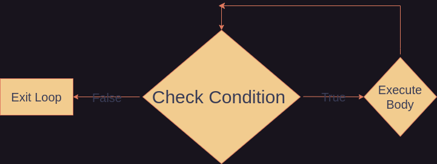

# While and Do-While Loops

The other, if not the most, fundamental structure in programming are *loops*. A loop checks a condition and executes the body, then rechecks and executes the body, until the condition is false. Each time the loop executes the body is call an *iteration*. The loop will *iterate* until the condtiion is false.

## While Loops
*While* loops are the simplest form of loops. Per the name, *while* loops iterate while their condtitions are true and until they are false. Once the condition is false, the loop *exits* and moves on to the next code.

*The flow of a while loop*

For example:
```Python
while(True):
	print("true")
```
This code is an infinite loop. It will iterate and print `"true` forever, since the condition is never false. Not very useful. Let's try a *while* loop with a changing condition.


