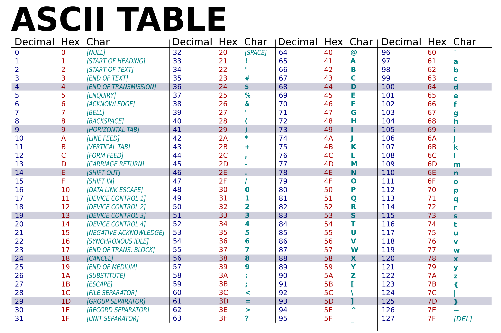

# ASCII and Unicode

## ASCII 

ASCII or (American Standard Code for Information Interchange) is a character *encoding* standard. In other words, it is a rule set used to determine what bit patterns represent what characters in the English language and other keys such as `Tab` and `Return`. ASCII was developed from telegraph codes such as Morse code, and is conceptually similar. 

Here is an ASCII table for reference:


The ASCII standard utilizes 8 bits which is a single byte. This allows for 127 possible patters than can be used to represent different characters and keystrokes.

But what if we need more? Only having access to Latin characters doesn't make this standard international. What if we want to represent characters of languages that don't use Latin characters such a Greek, Japanese, or Arabic? Furthermore, what if we want to represent other kinds of characters like images such as glyphs or emojis? For this we need another standard called *Unicode*.

## Unicode

Unicode or *The Unicode Standard* is a encoding standard that is a *superset* of ASCII. That means that Unicode includes ASCII encoding among other standards. The goal of Unicode is to unify the world's languages and methods of text encoding into a single universal standard. 

Unicode supports methods of encoding that utilize up to 32 bits. That is 4 bytes. And 4,294,967,296 possible characters.

There are far too many Unicode characters to list but know that essentially every world language and script is supported, along with every glyph and emoji we use every day.

## Emojis In Python
Websites such as [Unicode Lookup](https://unicodelookup.com/) are databases that can be searched for a specific character or emoji. The value that encodes the character can be used in scripts and will be printed as the emoji. For example:

```Python
message = "I love " + "\U0001F499" + " Python"  # Heart emoji
print(message)
```
Outputs:
> I love 💙 Python

Try looking up some emojis for yourself and see what you can do with them in Python.

---
## Further Reading

[ASCII](https://en.wikipedia.org/wiki/ASCII)

[Unicode Org](https://home.unicode.org/)


