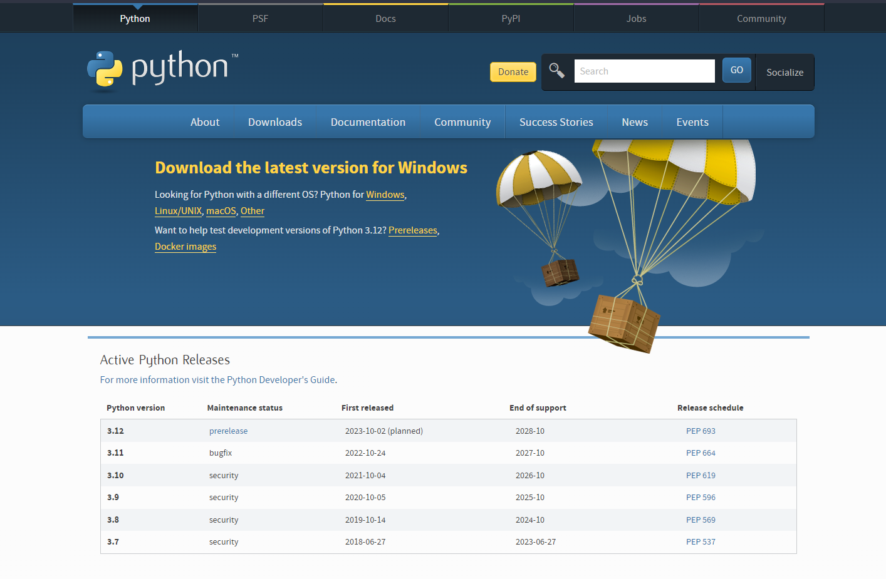
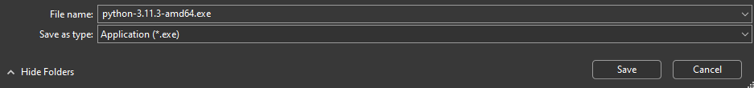
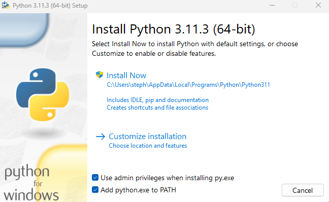
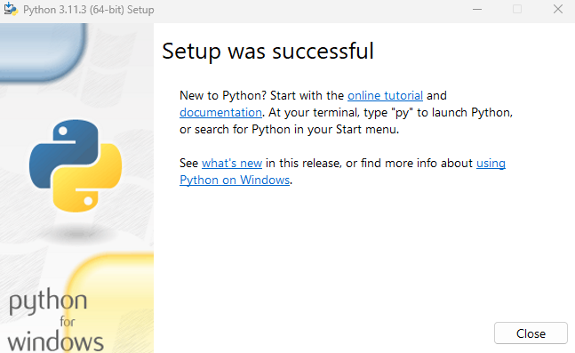

# Installing Python

## Windows 

The Python interpreter can be downloaded for Windows from the Python's official website.

[https://www.python.org/downloads/](https://www.python.org/downloads/)

Once the installer is downloaded,  go to the directory it was downloaded to and execute it. 

\
*The Python installer I downloaded to my computer.*

Once the installer is launched you will be greeted by this screen:

There are two options when installing.

### Admin Privileges
This option should be enabled assuming you are using your personal computer. Admin privileges in Windows generally allow you to install programs and alter specific files. Installing the Python interpreter with admin privileges will allow your scripts you write and run to have greater access to your computer, however this must be done responsibly; or else you may damage your operating system.

### Path Variable 
This option should be enabled. A path variable is a variable that contains every directory that your user can execute files from no matter what directory the user is currently in. Essentially, when this option is checked, the directory python is installed to will be added to your path variable, so you can execute the interpreter from anywhere.

There are some things installed alongside the interpreter by default like *pip*. Pip is a Python *package manager*. It will be discussed at the end of the book in the "And More..." section.

Once the interpreter is installed you will be greeted with a success screen.

## Mac
Follow this guide from [The Hitchhiker's Guide To Python](https://docs.python-guide.org/starting/install3/osx/) for installing Python 3.

## Linux

On the vast majority of Linux distributions, Python is already installed by default.

--- 

## Further Reading

[Python Download Page](https://python.org/downloads/)

[Python docs on Windows Python installation](https://docs.python.org/3/using/windows.html)

