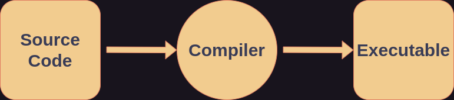
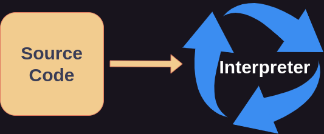

# Programming Languages

## Declarative vs Imperative

Programming is essentially the act of writing something that a computer understands and will have a computer do something based on what is written. The rules
by which to write something that a computer understands is called a programming *language*. There are two overarching types of languages. Also known as paradigms.

- Declarative Languages
- Imperative Languages

A declarative language describes how something is, or more technically it defines a state that the computer must reach. A declarative statement in human language
could be "The ball is red". Some examples of imperative languages are:

- YAML
- HTML
- SQL

An imperative language offers the instructions or commands to a computer it needs to perform to accomplish a task. An imperative statement in human language could be,
"Paint the ball red." Some examples of declarative languages are:

- C
- Java
- Rust

And many programming languages have the capability to be both declarative and imperative. There are many programming languages that have been designed and created in history by individuals, groups, organizations, and corporations
all over the world. However, the book will use imperative programming with the programming language **Python** to teach the basic concepts of programming. By understanding basic programming concepts, the languages you choose to write in will become secondary.

## Compiled vs Interpreted
The only thing a computer truly understands is 0s and 1s. *Binary code*. Also known as *machine code* or *machine instructions*. All the code written has to be somehow converted to 0s and 1s. So, 
along with the languages, programmers also design and create programs used to convert the code to binary. There are two primary ways of converting code to what a computer understands.

### Compilers

Compiled languages are languages where the source code of the language is passed to a *compiler*, which converts the source code to an *executable* or *binary* file. Programs are compiled to be run on
a specific machine or hardware. Therefore, to be run on another machine, it must be compiled for that machine, and every other machine it is to be ran on. 

*The path of code from source to executable*.

Compiled languages are often used to control hardware itself. Compiled languages are often used for:

* Robotics
* Operating Systems
* Embedded Software
* Device Drivers
* Automotives
* Aeronautics and Aerospace
* Video Game Engines

Some examples of compiled languages are:

* C
* C++
* Rust 
* Java
* Go

### Interpreters

Interpreted languages are languages where the source code of the languages is passed to an *interpreter*. The interpreter does not convert the source code to a binary file, but instead runs the source code itself line by line. Therefore, the source code of an interpreted language can be ran on any machine which runs the interpreter. The source code of interpreted languages is often referred to as *scripts*, and the languages *scripting* languages. This makes interpreted programs easier to run in more places, this is called *portability*. And interpreted languages are generally more portable than compiled ones. 

*Source code being given to the interpreter to be ran*.

Interpreted languages are often used for:

* Data Science and Statistics
* Artificial Intelligence
* Computing System Administration

Some examples of interpreted languages are:

* Python
* JavaScript 
* Shell 
* Powershell
* Ruby
* Lua

## Why Python?

Python is an interpreted programming language that is commonly used to teach new programmers the basics. This is because Python's design makes it a simpler language to read and write.

### Syntax

*Syntax* is the rules by which something is written. For example, in English adjectives come before nouns; and verbs tend to come before subjects. This is an example of English's syntax. However,
in Spanish adjectives tend to come after verbs. This is an example of Spanish's syntax and how human languages can differ in syntax.
The same is true for computer languages; the rules of writing something with the same meaning differs between languages. However, once you understand the basic concepts of programming, beginning to learn a new language is only a matter of getting familiar with its syntax.

### Portability
Python is *portable*, as in, the interpreter can be ran in many places, such as a desktop, laptop, phone, or tablet.

### Popularity
Python is an **extremely** popular language that is used across the world by both individuals and large companies and organizations.

---

This was just an **introduction** to the different programming paradigms and types of programming languages. There are many more categories languages can be divided and subdivided into. These categories aren't discussed here because they require a more advanced understanding of how programming languages work and are designed.

Python's design is what makes it suitable for both beginners and experienced programmers; and its design is why it is the most popular programming language in the world as of this writing. Next you will learn what programs can be used to actually write code in any given programming language, including Python.

## Further Reading
[Programming Paradigms](https://en.wikipedia.org/wiki/Programming_paradigm)

[Interpreter](https://en.wikipedia.org/wiki/Interpreter_(computing))

[Compiler](https://en.wikipedia.org/wiki/Compiler)

